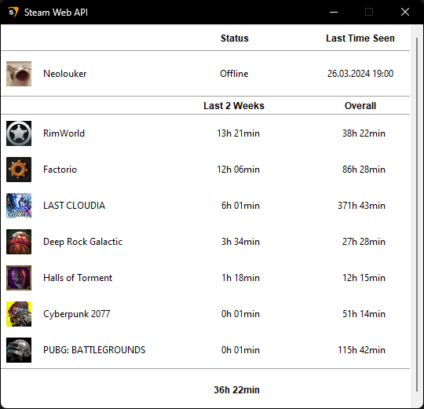

[](https://github.com/neolouker/Steam-Web-API-Client/actions/workflows/codeql.yml)
[](https://github.com/neolouker/Steam-Web-API-Client/actions/workflows/pylint.yml)

# Steam-Web-API-Client

Install dependencies:
```command
pip install -r requirements.txt
python main.py
```

## About



### Current State

> [!WARNING]
> The client is still in development!
